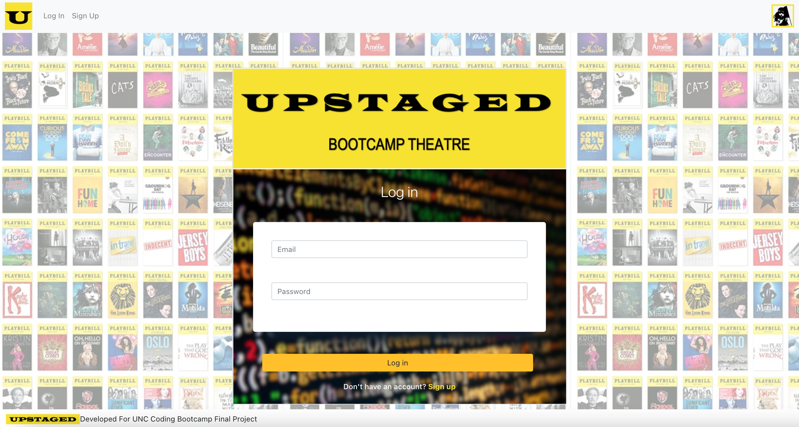
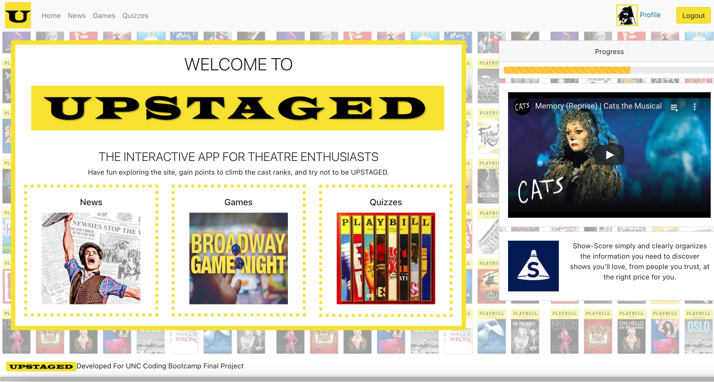
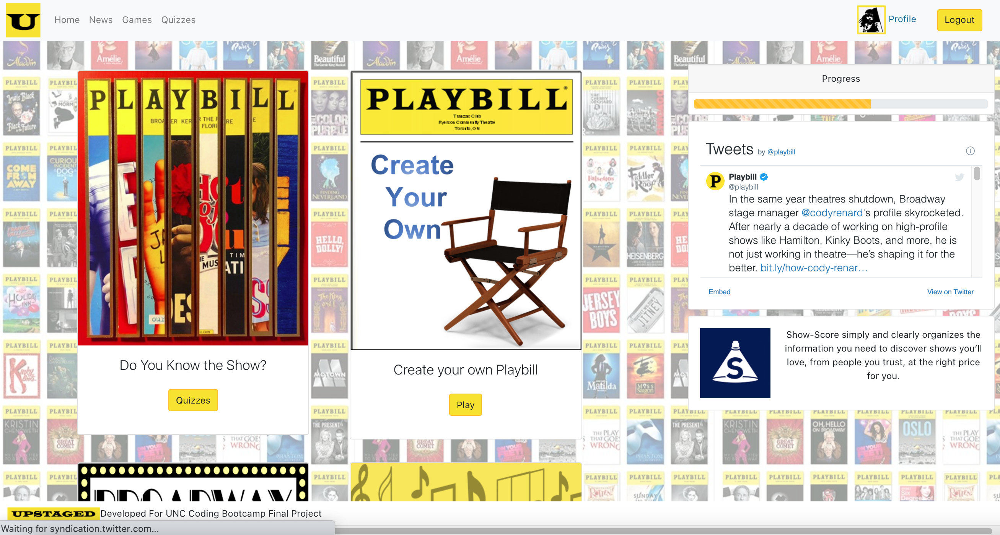

# Upstaged

Welcome to Upstaged! The interactive app for theatre enthusiasts. Have fun exploring our app, gain points to climb the cast ranks, and try not to be Upstaged!

## Project Details

Upstaged was created by theatre lovers, for theatre lovers. Upstaged is a multi-faceted and highly entertaining theatre app, created to entertain, amuse, and enjoy. Take part in the show, experiencing what it feels like to be immersed in the broadway experience, with various games, quizzes, videos, and feeds. Theatre Jeopardy, Hamilton Trivia, and a Playbill creator, just to name a few. Stay up to date on what's trending in broadway with our News page, as well as our Show-Score, Twitter, and Youtube feeds. We also hope you take a chance at securing the main role, gaining points and rank with each challenge, in order to be the best in show business. Share with friends and keep on shining, for you, are a star.

Thanks for stopping in!

## Application

Upstaged: https://upstaged.herokuapp.com/

Welcome: 

Mainpage: 

## Requirements:

Add a .env file in the client folder with the following:

REACT_APP_API_KEY=YourRapidApiKeyHere

## Build Details

This application was developed using: React.js, Components, User Authentication, Material-Table, Axios, Bootstrap, JavaScript, Node.js, APIs, and more!

## Repository & Preview

View the repository at: https://github.com/MichaelWitt/Upstaged

Games: 

Quizzes: 

## Updates

You can find project updates in the repository, highlighting what was done to create the final product.

https://github.com/MichaelWitt/Upstaged/commits/

## Credits

UNC Coding Bootcamp And Trilogy for the inspiration.

As well as The Theatre, NPM Material-Table, Web Search API, Bootstrap, React, Axios, and other NPM Packages.

## Thanks For Visiting!

Come back soon :)
